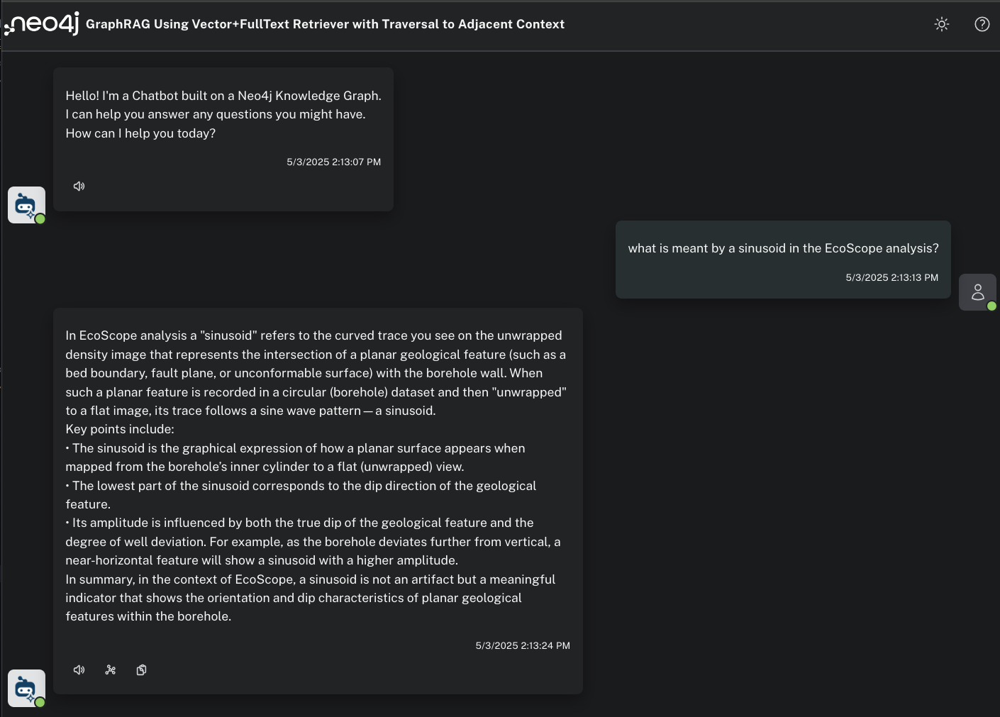
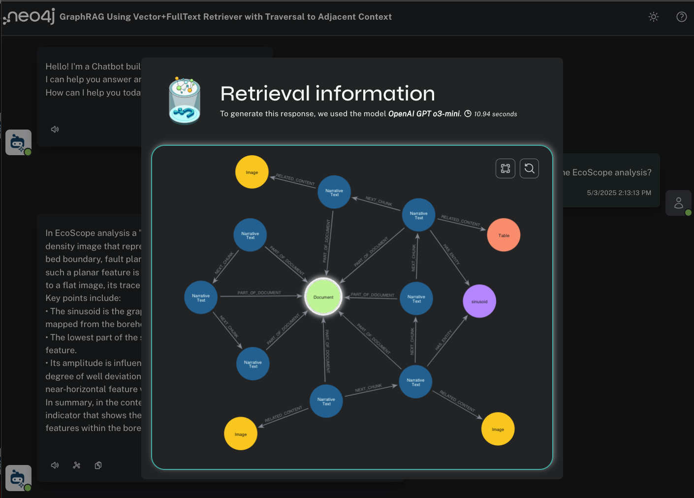

# aura-chatbot

### summary

Example GenAI chatbot application using GraphRAG on a Neo4j knowledge graph prepared using Unstructured.io high-resolution document parsing with table and image extraction.

The neo4j-graphrag hybrid retriever executes semantic (vector) search, full text search and graph traversal to discover contextual text, table and image content for increased accuracy and completeness.

Project components include:

- [Unstructured.io Client & API](https://docs.unstructured.io/api-reference/partition/overview)
- [Neo4j Needle framework](https://neo4j.com/labs/neo4j-needle-starterkit/)
- [neo4j_graphrag](https://neo4j.com/docs/neo4j-graphrag-python/current/index.html)

Any group of documents can be ingested with some minor adjustments to the ingest script.


### overview

A key challenge in GenAI is providing accurate, comprehensive and explainable responses for demanding technical audiences who want to see not just text -- but related tables, images and diagrams as well.

Unstructured.io is used to perform detailed parsing of documents from the open-source [Volve Field repository](https://www.equinor.com/energy/volve-data-sharing), including image and table extraction and write these to a Neo4j knowledge graph.

Documents are chunked using Unstructured's layout-aware partitioner and written as `:Chunk` nodes to Neo4j in document sequence using `-[:NEXT_CHUNK]->` relationships.

Extracted base64 image data is written to `:Image` nodes and html table data to `:Table` nodes, these are connected to the `:Chunk` nodes by  `-[:RELATED_CONTENT]->` relationships.

Vector embeddings are computed for the `:Chunk` texts and stored as a length 1536 property on the node.

To complete the lexical graph, entities are extracted from the `:Chunk` texts using a data domain specific prompt (in this case, for oil & gas) and merged as `:Entity` nodes connected by `-[:HAS_ENTITY]->` relationships.

The chatbot uses the [neo4j_graphrag hybrid retriever](https://neo4j.com/blog/developer/hybrid-retrieval-graphrag-python-package/) to simultaneously perform semantic search using native Neo4j vector indexing on `:Chunk` embeddings and Neo4j Lucene full text search indexing on `:Entity`, this yields a top-k collection of best matched `:Chunk` and `:Entity` nodes. Starting from this top-k collection there are further traversals to discover (a) preceding and following `[:NEXT_CHUNK]` nodes and (b) `:Chunk` nodes connected to `:Entity` nodes. All of the discovered `:Chunk` texts are sent to the LLM for summarization.

```
WITH node, score //top-k chunks and entities
OPTIONAL MATCH (node)-[:NEXT_CHUNK]-(c) // get chunk neighbors
OPTIONAL MATCH (node)<-[HAS_ENTITY]-(e) // get entity context chunks
ORDER BY score DESC LIMIT 100
RETURN apoc.convert.toSet(COLLECT(elementId(node))+COLLECT(elementId(e))+COLLECT(elementId(c))) AS listIds,
COLLECT (e.id) as contextNodes, node.text as nodeText, score ORDER BY score DESC
```

Now we can see the result: an accurate, contextual summary for a technical question:



Clicking on the graph icon, you challenge explore the top-k `:Chunk` and `:Entity` nodes as well as the traversal discovered neighbor nodes that were used for additional response context.



Click on any node to explore the text chunks, images, tables, etc.


Neo4j and Unstructured.io can be used together to build highly accurate, fully explainable GenAI experiences that include text, images, tables extracted in document context. The underlying knowledge graph can be further extended to include operational or other data for even more comprehensive results.

### build the graph
Install python dependencies:

```
pip install python-dotenv fastapi[standard] uvicorn openai unstructured_client unstructured_ingest neo4j neo4j-driver neo4j_graphrag neo4j_graphrag[openai]
```

get an OpenAi API key https://openai.com/

get an Unstructured API key https://unstructured.io/

create a Neo4j Aura graph database: https://neo4j.com/product/auradb/  and download connection credentials

open and run the jupyter notebook

### start the back end
from /backend

add and configure .env file, following the .env.example template

`uvicorn app.main:app --reload`


### start the front end
from /frontend

add and configure .env file, following the .env.example template

`yarn install`

`sudo yarn run dev`
